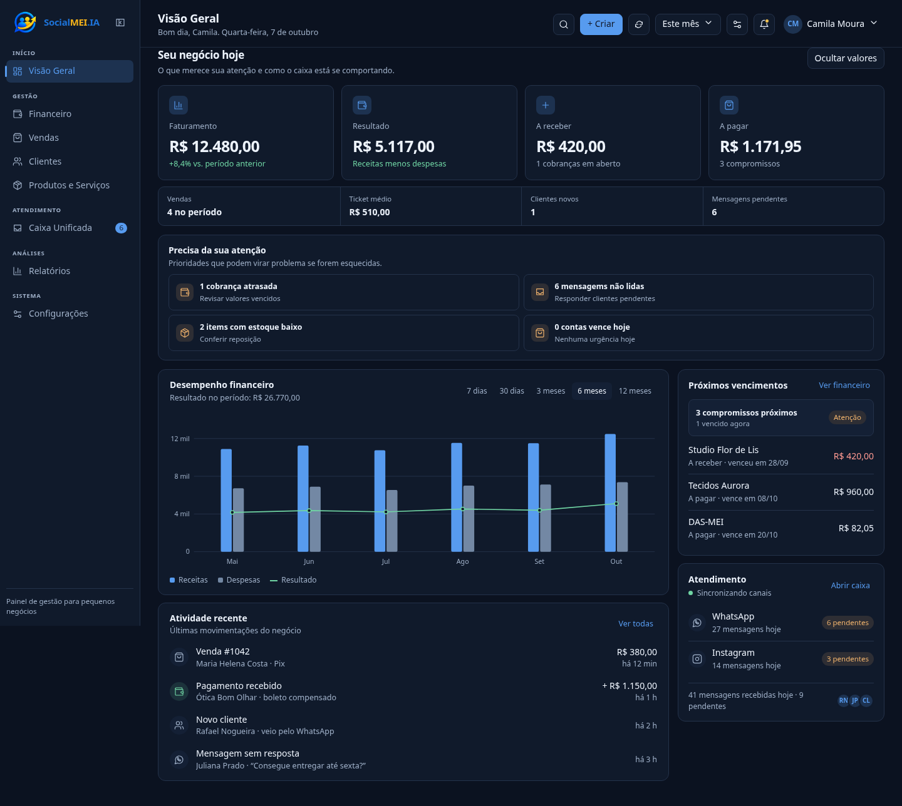
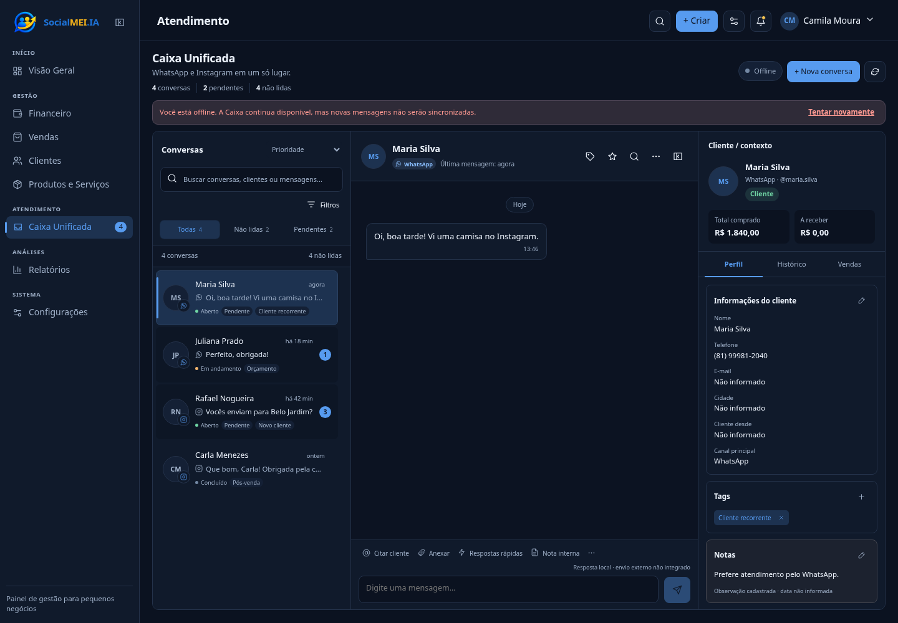
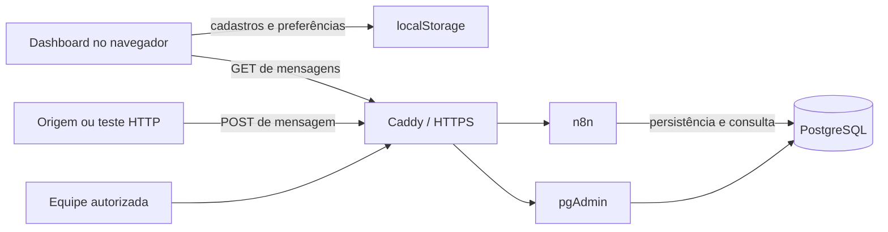

<p align="center">
  
</p>

<div align="center">

Gestão e atendimento para MEIs e pequenos negócios em um dashboard web, com Caixa Unificada e automações em n8n.

**Projeto acadêmico em desenvolvimento · Interface funcional com dados de demonstração**

**[Conhecer a interface](#interface)** · **[Começar a contribuir](./docs/ONBOARDING.md)**

[Sobre](#sobre-o-socialmeiia) · [Funcionalidades](#principais-funcionalidades) · [Interface](#interface) · [Tecnologias](#tecnologias) · [Arquitetura](#como-funciona) · [Execução](#executando-o-projeto) · [Status](#status-e-próximos-passos)

</div>

## Sobre o SocialMEI.IA

Atendimento, vendas e controle financeiro costumam ficar espalhados entre conversas e registros separados. O SocialMEI.IA reúne essas atividades em uma interface voltada à rotina de MEIs e pequenos negócios.

A proposta combina gestão e contexto do cliente com uma Caixa Unificada para WhatsApp e Instagram. A interface já permite explorar os módulos e trabalhar com registros locais; a integração de mensagens com n8n tem um fluxo próprio de leitura e uma estrutura PostgreSQL versionada.

**O estágio atual é de protótipo funcional.** Dados demonstrativos, operações locais e integrações em evolução são apresentados separadamente abaixo.

## Principais funcionalidades

| Módulo | O que está disponível |
| --- | --- |
| **Visão Geral** | Indicadores, gráfico financeiro, vencimentos e alertas com dados de demonstração. |
| **Financeiro** | Cadastro local de receitas/despesas, busca, filtros e marcação de pagamentos. |
| **Vendas** | Cadastro local, filtros, duplicação de vendas e atualização de status. |
| **Clientes** | Cadastro local, perfil, observações, etiquetas e contexto de compras/atendimento. |
| **Produtos e Serviços** | Cadastro local, preço, custo, margem estimada e ajustes de estoque. |
| **Caixa Unificada** | Conversas por canal, filtros, busca, favoritos, notas e consulta periódica ao n8n. |
| **Relatórios** | Resumos do protótipo, exportação financeira em CSV e impressão. |
| **Configurações** | Temas claro/escuro/automático, editor de temas, importação/exportação JSON e preferências locais. |

Os cadastros de gestão e preferências usam `localStorage` do navegador. Parte dos gráficos e indicadores é demonstrativa; eles não representam resultados reais de um negócio. A persistência PostgreSQL versionada se destina ao histórico de atendimento, não a todos os módulos.

### Caixa Unificada

A lista reúne conversas identificadas como WhatsApp ou Instagram, com histórico, estado do atendimento e informações do cliente. O frontend consulta o endpoint de mensagens do n8n a cada quatro segundos e incorpora os registros recebidos.

- **Entrada:** consulta remota implementada no frontend. O fluxo PostgreSQL versionado descreve recebimento, normalização, gravação e leitura de mensagens.
- **Saída:** respostas digitadas no dashboard são adicionadas localmente. Não há envio externo implementado nesse composer.
- **Canais oficiais:** há um workflow experimental de Instagram com agente Gemini e requisição à API do canal. Isso não comprova uma integração completa dos dois canais com o dashboard.

> A documentação registra a validação de recebimento e persistência na Sprint 3. Porém, o export PostgreSQL atual contém escapes inválidos de JSON e está marcado como inativo. Ele precisa de revisão antes de ser importado e validado em outro ambiente.

## Interface

Capturas da versão atual do repositório, em tema escuro e com os dados de demonstração incluídos no frontend. A captura da Caixa Unificada foi feita offline; ela não comprova conectividade com os canais.

### Dashboard

Indicadores e prioridades do negócio em uma única visão.

<p align="center">
  
</p>

### Caixa Unificada

Lista de conversas, histórico e contexto do cliente lado a lado no desktop. A interface adapta a navegação para telas menores.

<p align="center">
  
</p>

## Tecnologias

| Camada | Tecnologia e papel verificados |
| --- | --- |
| **Interface** | HTML, CSS e JavaScript sem framework; armazenamento local no navegador. |
| **Automação** | n8n: webhooks, consulta de mensagens e workflows de teste/integração. |
| **Dados** | PostgreSQL 16: schema `socialmei` com clientes, conversas e mensagens; banco interno do n8n. |
| **API auxiliar** | Python 3.12, FastAPI e Uvicorn: healthcheck e processamento simples de texto. |
| **Infraestrutura** | Docker Compose, Caddy para proxy/HTTPS e pgAdmin para administração do banco. |
| **Publicação e colaboração** | Frontend preparado para GitHub Pages; código, documentação e revisão pelo GitHub. |

Os exports experimentais de Instagram incluem nós de Google Gemini. A API Python atual transforma texto em maiúsculas e conta caracteres; ela não implementa um CRM completo nem um agente de IA.

## Como funciona

O dashboard roda no navegador. A leitura de mensagens passa pelo n8n, enquanto a gestão local permanece no navegador. O diagrama representa o fluxo previsto no código e no export versionado; sua reprodução depende de corrigir e configurar esse export.



O PostgreSQL mantém as tabelas funcionais no schema `socialmei`, separadas das tabelas internas do n8n. A configuração Compose não publica a porta 5432. Caddy encaminha os serviços web do n8n e do pgAdmin.

A API FastAPI fica na rede Docker e é chamada por um workflow de teste separado. Detalhes da infraestrutura estão no [guia de arquitetura](./docs/ARQUITETURA.md).

## Executando o projeto

### Frontend local

Pré-requisitos: Git, navegador e Python 3 para o servidor HTTP opcional.

```bash
git clone https://github.com/socialmei-ia/SocialMEI-IA.git
cd SocialMEI-IA
python -m http.server 5500
```

Abra **http://localhost:5500**. Também é possível abrir `index.html` diretamente no navegador. Não há etapa de instalação npm.

A interface funciona com os dados locais de demonstração mesmo sem conexão com o n8n. O endpoint de leitura está definido em `N8N_MESSAGES_URL` no frontend e aponta para o ambiente da equipe; um servidor HTTP local não cria o backend.

<details>
<summary><strong>Infraestrutura e teste da integração</strong></summary>

Para preparar um ambiente próprio, use Docker com Compose:

```bash
cp .env.example .env
# Preencha localmente as variáveis do ambiente.
docker compose config --quiet
docker compose up -d
```

Os domínios e variáveis de HTTPS devem corresponder ao ambiente configurado. O Compose inclui PostgreSQL, n8n, pgAdmin, Caddy e a API Python pelo arquivo de override.

A inicialização do histórico não é automática no Compose. Um responsável deve preparar as roles e aplicar os arquivos SQL na ordem documentada:

1. Criar a role administrativa e configurar sua senha fora do GitHub.
2. Aplicar [`bootstrap.sql`](./database/bootstrap.sql), [`schema.sql`](./database/schema.sql) e [`permissions.sql`](./database/permissions.sql). Os scripts de permissões referenciam o banco `n8n`; confira o nome adotado no ambiente.
3. Revisar o [export PostgreSQL](./n8n-workflows/producao/01-caixa-unificada-api-postgresql.json), corrigir seus escapes e validar JSON, código dos nós e consultas antes da importação.
4. Configurar a credencial técnica PostgreSQL no n8n e validar o workflow antes de ativá-lo.
5. Configurar o endpoint de leitura do frontend para o ambiente de teste, mantendo `index.html` e `frontend/socialmei-dashboard.html` sincronizados.
6. Enviar uma mensagem de teste ao webhook configurado e confirmar o registro no banco e na Caixa Unificada.

Consulte os guias de [Docker](./docs/DOCKER.md), [banco](./docs/BANCO-DE-DADOS.md) e [acessos](./docs/ACESSOS.md). Mudanças na VPS seguem o processo de revisão e aplicação pela equipe responsável.

</details>

## Status e próximos passos

- [x] Interface responsiva com módulos de gestão e atendimento.
- [x] Cadastros e preferências locais, temas personalizados e exportação CSV.
- [x] Consulta periódica de mensagens do n8n implementada no frontend.
- [x] Schema PostgreSQL, permissões e infraestrutura versionados.
- [ ] Integração oficial completa de WhatsApp/Instagram com o dashboard.
- [ ] Envio externo de respostas pela Caixa Unificada.

As duas evoluções de integração já constam da documentação do projeto. A revisão do export PostgreSQL é uma pendência identificada nesta auditoria. Serviços configurados no repositório não são, por si só, comprovação de disponibilidade online.

<details>
<summary><strong>Registro da Sprint 3 — US-018</strong></summary>

A documentação anterior registra como validados: integração webhook/interface, persistência de histórico PostgreSQL, canais na mesma tela, alternância entre conversas, UTF-8 e acesso pgAdmin via HTTPS. Também registra o versionamento do workflow e os procedimentos de Docker e acesso individual.

Esse registro preserva o histórico da equipe. A disponibilidade atual dos serviços e a reprodução do fluxo em um novo ambiente devem ser verificadas separadamente.

</details>

## Documentação

| Guia | Conteúdo |
| --- | --- |
| [Onboarding](./docs/ONBOARDING.md) | Onde trabalhar e como começar. |
| [Arquitetura](./docs/ARQUITETURA.md) | Camadas e fluxo de atendimento documentado. |
| [Banco de dados](./docs/BANCO-DE-DADOS.md) | Schema, roles e manutenção estrutural. |
| [Docker](./docs/DOCKER.md) | Serviços, validação, aplicação e rollback. |
| [Acessos](./docs/ACESSOS.md) | Contas e permissões da equipe. |
| [Contribuição](./CONTRIBUTING.md) | Branches, commits e Pull Requests. |
| [Segurança](./SECURITY.md) | Tratamento de segredos e acessos sensíveis. |

<details>
<summary><strong>Estrutura do repositório</strong></summary>

```text
SocialMEI-IA/
├── index.html                     # entrada do site estático
├── frontend/                      # dashboard editável, sincronizado com index.html
├── n8n-workflows/                  # exports de automação e testes
│   └── producao/                   # export do fluxo PostgreSQL, a revisar
├── database/                      # bootstrap, schema e permissões
├── python-service/                # API auxiliar FastAPI
├── docs/                          # guias da equipe
│   └── assets/                    # imagens de apresentação
├── compose.yaml                   # infraestrutura principal
├── compose.override.yaml          # API Python
├── Caddyfile                      # proxy e HTTPS
├── backup.sh                      # rotina de backup do ambiente da equipe
└── .env.example                   # variáveis de configuração
```

O script de backup contém caminhos específicos da VPS da equipe e interrompe temporariamente o n8n. Confira o guia de infraestrutura antes de operá-lo.

</details>

## Colaboração

Projeto acadêmico em evolução. Contribuições seguem **branch → Pull Request → revisão**; mudanças de infraestrutura são aplicadas pelos responsáveis autorizados. Veja o [guia de contribuição](./CONTRIBUTING.md).

Não publique `.env`, senhas, tokens, chaves privadas, credenciais ou backups sensíveis. Use contas individuais e os procedimentos de [segurança](./SECURITY.md).

---

<p align="center">
  <br />
  Gestão e contexto do cliente em uma mesma interface.
</p>
