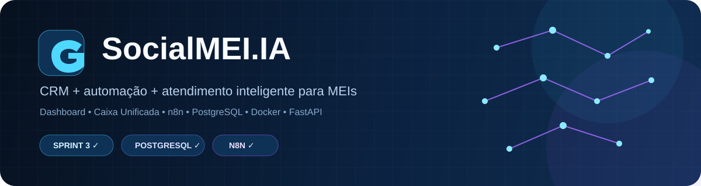
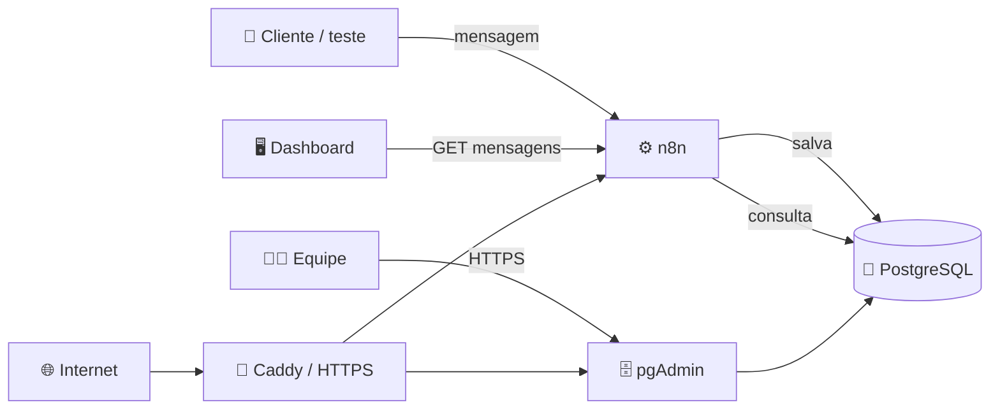
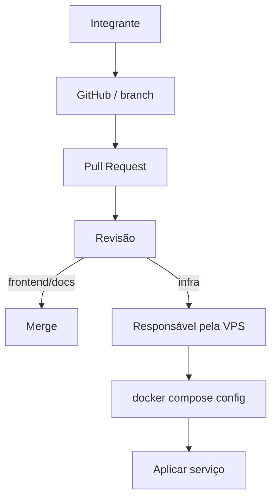

<div align="center">



# SocialMEI.IA

### Gestão, automação e atendimento inteligente para MEIs

[](#-status)
[](#-sprint-3--us-018)
[](./database)
[](./n8n-workflows)
[](./compose.yaml)

**[🌐 Abrir Dashboard](https://socialmei-ia.github.io/socialmei/)** ·
**[🚀 Começar no projeto](./docs/ONBOARDING.md)** ·
**[🏗️ Arquitetura](./docs/ARQUITETURA.md)** ·
**[🔐 Acessos](./docs/ACESSOS.md)**

</div>

---

## ✨ O que é o SocialMEI.IA?

O **SocialMEI.IA** é um projeto acadêmico de CRM e automação para MEIs e pequenos negócios. Ele combina um dashboard simples com uma **Caixa Unificada**, automações no **n8n**, histórico persistente no **PostgreSQL** e uma infraestrutura reproduzível com **Docker**.

A ideia é reduzir a complexidade de ferramentas empresariais tradicionais e concentrar atendimento, gestão e automação em um fluxo visual e fácil de operar.

## 🚀 Acesso rápido

| 👀 Quero... | Abrir |
|---|---|
| **Ver o sistema funcionando** | [Dashboard público](https://socialmei-ia.github.io/socialmei/) |
| **Entrar no projeto como integrante** | [Onboarding](./docs/ONBOARDING.md) |
| **Entender a arquitetura** | [Arquitetura](./docs/ARQUITETURA.md) |
| **Entender quem acessa o quê** | [Acessos e permissões](./docs/ACESSOS.md) |
| **Adicionar/alterar serviço Docker** | [Guia Docker](./docs/DOCKER.md) |
| **Entender o banco** | [Banco de dados](./docs/BANCO-DE-DADOS.md) |
| **Editar o dashboard** | [Frontend](./frontend/socialmei-dashboard.html) |
| **Ver o workflow oficial** | [Caixa Unificada PostgreSQL](./n8n-workflows/producao/01-caixa-unificada-api-postgresql.json) |
| **Administrar banco via web** | [pgAdmin](https://db.54-94-213-7.sslip.io) *(login necessário)* |

## 🧩 O que já funciona

<table>
<tr>
<td width="50%" valign="top">

### 🖥️ Dashboard
- Visão Geral
- Financeiro
- Vendas
- Clientes
- Produtos / Serviços
- Relatórios
- Configurações
- temas claro/escuro
- layout responsivo

</td>
<td width="50%" valign="top">

### 💬 Caixa Unificada
- mensagens processadas pelo n8n
- WhatsApp + Instagram na mesma tela
- histórico persistente
- troca entre conversas
- sincronização com endpoint
- caracteres UTF-8 validados

</td>
</tr>
<tr>
<td width="50%" valign="top">

### ⚙️ Backend / automação
- n8n
- PostgreSQL
- FastAPI
- webhooks
- roles separadas para aplicação/administração

</td>
<td width="50%" valign="top">

### 🐳 Infraestrutura
- Docker Compose
- Caddy + HTTPS
- pgAdmin
- PostgreSQL sem 5432 pública
- GitHub como fonte de verdade
- acesso administrativo sob demanda

</td>
</tr>
</table>

> **Limite atual:** a Caixa Unificada já recebe, persiste e exibe mensagens pelo fluxo do n8n. A integração oficial completa com APIs de WhatsApp/Instagram e o envio externo real de respostas continuam como evolução do projeto.

## 🏗️ Arquitetura



Mais detalhes em **[docs/ARQUITETURA.md](./docs/ARQUITETURA.md)**.

## 💬 Caixa Unificada: fluxo atual

```text
Mensagem / requisição
        ↓
Webhook n8n
        ↓
Normalização
        ↓
PostgreSQL
  ├─ clientes
  ├─ conversas
  └─ mensagens
        ↓
Endpoint GET n8n
        ↓
Dashboard
        ↓
WhatsApp + Instagram
```

## ✅ Sprint 3 — US-018

**Integração Webhook + Interface do Dashboard**

| Entrega | Estado |
|---|---|
| Frontend conectado às saídas dos webhooks | ✅ |
| Histórico de conversas salvo no PostgreSQL | ✅ |
| WhatsApp + Instagram em tela única | ✅ |
| Alternância entre conversas validada | ✅ |
| UTF-8 validado | ✅ |
| pgAdmin disponível por HTTPS | ✅ |
| Workflow PostgreSQL versionado | ✅ |
| Processo de Docker documentado | ✅ |
| Política de acesso por integrante | ✅ |

## 👥 Colaboração sem depender de uma pessoa



**SSH, Docker e AWS não precisam ser liberados para toda a equipe.** O acesso é individual e concedido sob demanda.

→ [Como liberar acesso para um novo integrante](./docs/ACESSOS.md)

→ [Como instalar um novo serviço no Docker](./docs/DOCKER.md)

## 🗂️ Estrutura do repositório

```text
socialmei/
├── index.html
├── frontend/
│   └── socialmei-dashboard.html
├── n8n-workflows/
│   └── producao/
│       └── 01-caixa-unificada-api-postgresql.json
├── database/
│   ├── bootstrap.sql
│   ├── schema.sql
│   └── permissions.sql
├── docs/
│   ├── ACESSOS.md
│   ├── ARQUITETURA.md
│   ├── BANCO-DE-DADOS.md
│   ├── DOCKER.md
│   ├── ONBOARDING.md
│   └── assets/
│       └── socialmei-banner.svg
├── python-service/
├── compose.yaml
├── compose.override.yaml
├── Caddyfile
├── .env.example
├── CONTRIBUTING.md
└── SECURITY.md
```

## 🧪 Testes rápidos

<details>
<summary><strong>▶️ Abrir o frontend localmente</strong></summary>

```bash
python -m http.server 5500
```

Depois abra `http://localhost:5500`.

</details>

<details>
<summary><strong>💬 Validar a Caixa Unificada</strong></summary>

1. Confirme que o workflow oficial está publicado no n8n.
2. Abra o dashboard.
3. Entre em **Caixa Unificada**.
4. Envie uma requisição de teste para o webhook.
5. Aguarde a sincronização.
6. Confirme a conversa no painel e no PostgreSQL.

</details>

<details>
<summary><strong>🐳 Validar uma mudança Docker</strong></summary>

```bash
docker compose config >/dev/null && echo "COMPOSE OK" || echo "ERRO NO COMPOSE"
```

Depois siga [docs/DOCKER.md](./docs/DOCKER.md).

</details>

## 🔐 Segurança

<div align="center">

**Sem senhas no GitHub · Sem .pem compartilhada · PostgreSQL sem 5432 pública · Acesso administrativo individual**

</div>

Nunca publique `.env`, chaves privadas, tokens, credenciais do n8n, dumps ou backups sensíveis.

Consulte **[SECURITY.md](./SECURITY.md)** e **[docs/ACESSOS.md](./docs/ACESSOS.md)**.

## 📊 Status

| Área | Estado |
|---|---|
| Dashboard | 🟢 Funcional / em evolução |
| Caixa Unificada | 🟢 Protótipo funcional persistente |
| n8n | 🟢 Online |
| PostgreSQL | 🟢 Persistência ativa |
| pgAdmin | 🟢 Acesso web autenticado |
| FastAPI | 🟢 Serviço ativo |
| Docker / Caddy | 🟢 Infraestrutura ativa |
| GitHub Pages | 🟢 Publicado |
| WhatsApp / Instagram oficiais | 🟡 Integração completa em evolução |
| Envio externo real pelo dashboard | 🟡 Ainda não integrado |

---

<div align="center">

### SocialMEI.IA

**Tecnologia prática para quem precisa cuidar do negócio — não da complexidade.**

Projeto acadêmico em evolução.

</div>
