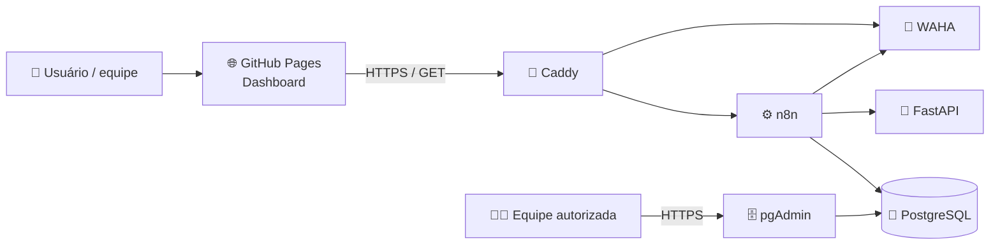
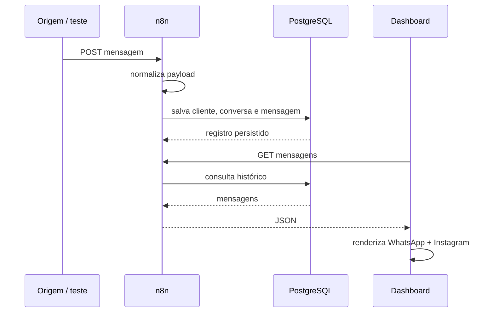

# Arquitetura — SocialMEI.IA

## Visão geral

## Caixa Unificada — fluxo validado na Sprint 3

## Camadas

| Camada | Tecnologia | Papel |
|---|---|---|
| Interface | HTML, CSS, JavaScript | Dashboard e Caixa Unificada |
| Publicação | GitHub Pages | entrega do frontend |
| Automação | n8n | webhooks e orquestração |
| Dados | PostgreSQL | histórico persistente |
| Administração do banco | pgAdmin | interface web autenticada |
| API auxiliar | FastAPI | serviços Python |
| WhatsApp | WAHA | sessão e API de integração com WhatsApp |
| Proxy / HTTPS | Caddy | roteamento e TLS |
| Infraestrutura | Docker Compose | containers e rede |
| Colaboração | GitHub | código, revisão e documentação |

## Segurança por desenho

- PostgreSQL não publica 5432.
- Caddy é o ponto de entrada HTTPS.
- WAHA não expõe a porta 3000 diretamente à internet; o acesso web passa pelo Caddy.
- n8n e WAHA se comunicam pela rede Docker interna.
- n8n usa uma role técnica para os dados funcionais.
- credenciais reais ficam fora do GitHub;
- SSH e Docker são concedidos individualmente e sob demanda;
- infraestrutura deve ser reproduzível a partir do repositório.

## Limite atual

A Caixa Unificada já demonstra e persiste mensagens de WhatsApp e Instagram recebidas pelo fluxo do n8n. A integração oficial completa com APIs dos canais, especialmente envio externo de respostas, continua como evolução futura.

## Endpoints publicados no ambiente atual

- n8n: `https://socialmei.54-94-213-7.sslip.io`
- pgAdmin: `https://db.54-94-213-7.sslip.io`
- WAHA Dashboard: `https://waha.54-94-213-7.sslip.io/dashboard`
- FastAPI: `https://api.54-94-213-7.sslip.io`

O n8n acessa o WAHA internamente por `http://waha:3000`, mantendo a API key fora do frontend.
