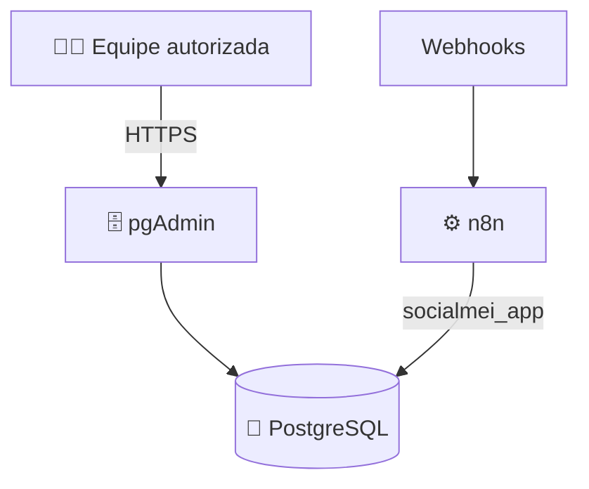

# Banco de dados — SocialMEI.IA

## Objetivo

O PostgreSQL guarda o histórico persistente da Caixa Unificada. A equipe não depende do computador de um integrante: o banco fica no servidor e o acesso humano é feito preferencialmente pelo **pgAdmin via HTTPS**.

## Arquitetura



A porta 5432 do PostgreSQL continua **sem publicação direta na internet**.

## Estrutura funcional

O schema `socialmei` é versionado em `database/schema.sql`:

```text
socialmei
├── clientes
├── conversas
└── mensagens
```

As tabelas internas do n8n permanecem separadas.

## Acesso web

pgAdmin:

`https://db.54-94-213-7.sslip.io`

O login é autenticado. Contas humanas devem ser individuais e criadas somente para quem precisar.

Veja também [ACESSOS.md](./ACESSOS.md).

## Roles atuais

| Role | Uso | Princípio |
|---|---|---|
| `socialmei_admin` | manutenção estrutural do schema funcional | administrativo, uso restrito |
| `socialmei_app` | n8n / automações | leitura e escrita funcional sem privilégios administrativos |

As senhas não ficam no GitHub.

## Arquivos reproduzíveis

- `database/bootstrap.sql` — prepara o schema com a role administrativa já criada;
- `database/schema.sql` — cria tabelas, índices e restrições;
- `database/permissions.sql` — aplica permissões da role técnica de automação.

## Alterando a estrutura

Mudanças relevantes devem ficar registradas no GitHub:

```text
branch → SQL/migration → revisão → teste → merge → backup → aplicar
```

Não faça uma mudança estrutural importante apenas pelo painel sem também versionar a alteração.

## Novos integrantes

Não é necessário criar acesso ao banco para todos antecipadamente. Quando alguém precisar:

1. crie uma conta individual no pgAdmin;
2. crie/atribua uma role PostgreSQL com o menor privilégio necessário, se for preciso acesso SQL próprio;
3. nunca compartilhe `socialmei_admin` como login coletivo;
4. documente a finalidade do acesso sem registrar a senha.

## Segurança

- não expor 5432;
- não publicar `.env`;
- não salvar senhas em documentação;
- não usar login administrativo em automações;
- fazer backup antes de migrations destrutivas;
- revisar SQL antes de produção;
- revogar acesso quando deixar de ser necessário.
