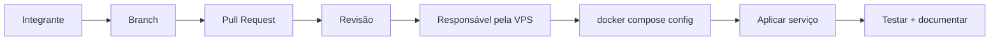

# Docker e infraestrutura — guia da equipe

> Guia prático para adicionar, alterar e recuperar serviços sem deixar mudanças apenas na VPS.

## Regra principal

Qualquer integrante pode **preparar** uma mudança pelo GitHub. Somente responsáveis autorizados pela infraestrutura devem **aplicar** a mudança na VPS.



Acesso ao Docker oferece poder administrativo elevado sobre o servidor. Não é necessário dar Docker para toda a equipe.

## Serviços atuais

| Serviço | Container | Função | Exposição |
|---|---|---|---|
| Caddy | `socialmei-caddy` | HTTPS / reverse proxy | 80 e 443 |
| n8n | `socialmei-n8n` | automações e webhooks | rede Docker/Caddy |
| PostgreSQL | `socialmei-postgres` | banco principal | **5432 apenas interna** |
| pgAdmin | `socialmei-pgadmin` | administração web do banco | rede Docker/Caddy |
| FastAPI | `socialmei-python` | API Python | rede Docker |

## Quero instalar um novo programa

### 1. Criar branch

```bash
git switch main
git pull origin main
git switch -c feat/adicionar-novo-servico
```

### 2. Alterar o Compose

Boas práticas:

- prefira versão fixa de imagem em vez de `:latest` quando possível;
- use `restart: unless-stopped`;
- use volume nomeado para dados persistentes;
- adicione `healthcheck` quando suportado;
- mantenha segredos no `.env`;
- não publique portas sem necessidade;
- para serviço web, prefira acesso por Caddy;
- documente variáveis novas em `.env.example`.

### 3. Validar

```bash
docker compose config >/dev/null && echo "COMPOSE OK" || echo "ERRO NO COMPOSE"
```

Se der erro, não aplique.

### 4. Abrir Pull Request

Inclua objetivo, teste, variáveis/volumes/portas e rollback.

### 5. Aplicar somente o necessário

Antes:

```bash
docker compose ps
```

Subir serviço:

```bash
docker compose up -d --no-deps NOME_DO_SERVICO
```

Recriar apenas ele:

```bash
docker compose up -d --no-deps --force-recreate NOME_DO_SERVICO
```

## Logs e diagnóstico

```bash
docker logs --tail 100 NOME_DO_CONTAINER
docker compose ps
docker compose config
```

Para acompanhar:

```bash
docker logs -f NOME_DO_CONTAINER
```

## Cuidado extra

Faça backup e planeje rollback antes de:

- apagar/recriar volumes;
- migrations destrutivas;
- trocar banco;
- alterar credenciais de produção;
- trocar a chave de criptografia do n8n;
- publicar novas portas;
- usar `docker compose down -v`.

> Não altere a chave de criptografia do n8n de forma improvisada. Ela protege credenciais salvas.

## Rollback

1. pare novas alterações;
2. identifique o commit;
3. reverta/restaure pelo GitHub;
4. valide `docker compose config`;
5. recrie somente o serviço afetado;
6. confira logs e status;
7. teste o fluxo.

## Não faça

- editar Compose só na VPS e esquecer o GitHub;
- compartilhar `.env`, `.pem`, tokens ou senhas;
- expor PostgreSQL diretamente;
- usar `down -v` sem entender o impacto;
- apagar volume sem backup;
- dar Docker a todos por conveniência;
- instalar manualmente algo que pode ser reproduzido pelo Compose.

## Novos responsáveis

SSH e Docker são concedidos sob demanda. Veja [ACESSOS.md](./ACESSOS.md).
